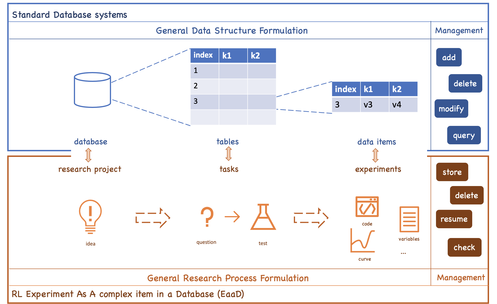

# RL experiment Assistant (RLA)

RLA is a tool for managing your RL experiments automatically (e.g., your hyper-parameters, logs, checkpoints, figures, and code, etc.). 
RLA has decoupled to the training code and only some additional configuration are needed. Before using RLA, we recommend you to read the section "Design Principles of RLA", which will be helpful for you to understand the basic logic of the repo. 

[comment]: <> (The logger function of RLA is forked from and compatible with the logger object in [openai/baselines]&#40;https://github.com/openai/baselines&#41;. You can transfer your logging system easily from the "baselines.logger" by modifying the import lines &#40;i.e., ```from baselines import logger``` -> ```from RLA.easy_log import logger```&#41;.)

The project is still in developing. Welcome to join us. :)

We maintain an RLA in https://github.com/polixir/RLAssistant in the future which will consider extra requirements needed in the team cooperation scenario.


## Design Principles of RLA


The core design principle of RLA is regarding all related information of each Experiment As A complex item in a Database (EaaD). 
We design RLA to manage the experiments dataset by 
1. formulating, standardizing, and structuring the data items and tables of the "RL experiment database";
2. provide tools for adding, deleting, modifying, and querying the items in the database.

The following are the detailed designs of EaaD and the implementation of RLA.
### Standardizing and Structuring the Experiment Database
After integrating RLA into your project, we create a "database" implicitly configured by `rla_config.yaml`. 
Each experiment we run will be indexed and stored as an item into a "table". In particular, RLA includes the following elelments to construct an "RL experiment database".
1. **Database**: A database is configured by a YAML file `rla_config.yaml`. In our practice, we only create one database in one research subject.
2. **Table**: We map the concept of Table in standard database systems into the concept of "task" in our research process. There are many similarities between the two concepts. For example, we will create another table/task often when:
   1. the structures of tables are different, e.g., they have different keys. In the research process, different tasks often have totally different types of logs to record. For example, in offline model-based RL, the first task might pretrain a dynamics model the second task might be policy learning with the learned model. In model learning, we are concerned with the MSE of the model; In policy learning, we are concerned with the rewards of policy. 
   2. The content of a table is too large which might hurt the speed of querying.  Table partition is a common solution. In the research process, we need large memory to load a Tensorboard if the logdir has many runs. We can solve the problem by splitting the runs into different sub-directories.
   
   In RLA, we need to assign a "task" for each experiment to run.
3. **Data Item**:  We map the concept of the data item to the complex generated data in an experiment. For each data item, we need to define the index and the value for each item.
   1. **Index**: We need a unique index to define the item in a table for item adding, deleting, modifying, and querying. In RLA, we define the index of each experiment as: `datetime of the experiment (for uniqueness) + ip address (for keeping uniqueness in distributed training) + tracked hyper-parameters (easy to identify and easy to search)`.
   2. **Value**: when running an experiment, we generate many data with different structures. Based on our research practice, currently, we formulate and store the following data
      1. Codes and hyper-parameters: Every line of the code and select hyper-parameters to run the experiment. This is a backup for experiment reproducibility.    
      2. Recorded variables: We often record many intermediate variables in the process of the experiment, e.g., the rewards, some losses, or learning rates. We record the variables in the key-value formulation and store them in a tensorboard event and a CSV file.   
      3. Model checkpoints: We support weights saving of neural networks and related custom variables in Tensorflow and Pytorch framework. We can use the checkpoints to resume experiments or use the results of the experiment to complete downstream tasks.
      4. Other data like figures or videos: It essentially is unstructured intermediate variables in the process of the experiment. We might plot the frame-to-frame video of your agent behavior or some curves to check the process of training. We give some common tools in the RL scenario to generate the related variables and store them in a directory. 

Currently, we store the data items in standard file systems and manage the relationships among data items, tables, and database via a predefined directory structure. After running some experiments, the database will be something like this:

- Here we construct a database in the project "sb_ppo_example". 
- The directory "archive_tester" is to store hyper-parameters and related variables for experiment resuming. 
- The directory "results" is to store other data like figures or videos.
- The directory "log" is to store recorded variables.
- The directory "code" is a backup of code for experiment reproducibility.
- The directory "checkpoint" save weights of neural networks.
- We have a table named "demo_task", which is the root directory of log/archive_tester/checkpoint/code/results. 
- The "index" of experiments in named in the formulation of `${%Y}/${%m}/${%d}/${%H-%M-%S-%f}_${ip address}_${tracked hyper-parameters}`.


### Tools to Manage the Database

In standard database systems, the commonly used operations to manage a database are adding, deleting modifying, and querying. We also give similar tools to manage the RLA database.

Adding:
1. RLA.easy_log.tester.exp_manager is a global object to create experiments and manger the data in the process of experiments.
2. RLA.easy_log.logger is a module to add recorded variables.
3. RLA.easy_log.simple_mat_plot is a module to construct other data like figures or videos

Deleting:
1. rla_scripts.delete_log: a tool to delete a data item by regex;

Modifying:
1. resume: RLA.easy_log.exp_loader.ExperimentLoader: a class to resume an experiments with different flexible settings. 

Querying:
1. tensorboard: the recorded variables are added to tensorboard events and can be loaded via standard tensorboard tools.
  
2. easy_plot: We give some APIs to load and visualize the data in CSV files. The results will be something like this:
   ```python
    from RLA.easy_plot.plot_func_v2 import plot_func
    data_root='your_project'
    task = 'sac_test'
    regs = [
        '2022/03/01/21-[12]*'
    ]
    _ = plot_func(data_root=data_root, task_table_name=task, 
   regs=regs , split_keys=['info', 'van_sac', 'alpha_max'], metrics=['perf/rewards'])
   ```
    


### Other principles

The second design principle is easy for integration. It still has a long way to go to achieve it. We give several example projects integrating with RLA in the directory example. 

1. PPO with RLA based on the [stable_baselines (tensorflow)](https://github.com/Stable-Baselines-Team/stable-baselines): example/sb_ppo_example
2. PPO with RL based on the [stable_baselines3 (pytorch)](https://github.com/DLR-RM/stable-baselines3): example/sb3_ppo_example

We also list the RL research projects using RLA as follows:
1. [MAPLE](https://github.com/xionghuichen/MAPLE)
2. [CODAS](https://github.com/xionghuichen/CODAS)

## Installation
```angular2html
git clone https://github.com/xionghuichen/RLAssistant.git
cd RLAssistant
pip install -e .
```


## Workflow


We build an example project for integrating RLA, which can be seen in ./example/simplest_code. Now we summarize the steps to use it.

### Step1: Configuration. 
1. We define the property of the database in `rla_config.yaml`. You can construct your YAML file based on the template in ./example/simplest_code/rla_config.yaml. 
2. We define the property of the table in exp_manager.config. Before starting your experiment, you should configure the global object RLA.easy_log.tester.exp_manager like this:
    ```python
    from RLA import exp_manager
    import os
    kwargs = {'env_id': 'Hopper-v2', 'lr': 1e-3}
    exp_manager.set_hyper_param(**kwargs) # kwargs are the hyper-parameters for your experiment
    exp_manager.add_record_param(["env_id"]) # add parts of hyper-parameters to name the index of data items for better readability.
    task_name = 'demo_task' # define your task
   
    def get_package_path():
        return os.path.dirname(os.path.abspath(__file__))

    rla_data_root = get_package_path() # the place to store the data items.
   
    rla_config = os.path.join(get_package_path(), 'rla_config.yaml')

    ignore_file_path=os.path.join(get_package_path(), '.gitignore')
    exp_manager.configure(task_table_name=task_name, ignore_file_path=ignore_file_path,
                        rla_config=rla_config, data_root=rla_data_root)
    exp_manager.log_files_gen() # initialize the data items.
    exp_manager.print_args()
   ```
   where ``ignore_file_path`` is a gitignore-style file, which is used to ignored files when backing up your project into ``code`` folder.
   It is an optional parameter, and you can use your `.gitignore` file of your git repository  directly.
    
4. We add the generated data items to .gitignore to avoid pushing them into our git repo.
   ```gitignore
   **/archive_tester/**
   **/checkpoint/**
   **/code/**
   **/results/**
   **/log/**
   **/arc/**
   ```
### Step2: record intermediate variables/checkpoints/other types of data.

**Record intermediate scalars**

We record scalars by `RLA.easy_log.logger`: 
```python
from RLA import logger
import tensorflow as tf
from RLA import time_step_holder

for i in range(1000):
    # time-steps (iterations)
    time_step_holder.set_time(i)
    # scalar variable
    value = 1
    logger.record_tabular("k", value)
    # tensorflow summary
    summary = tf.Summary()
    logger.log_from_tf_summary(summary)

```
**Record checkpoints**

We save checkpoints of neural networks by `exp_manager.save_checkpoint`.
```python
from RLA import exp_manager
exp_manager.new_saver()

for i in range(1000):
    if i % 10 == 0:
        exp_manager.save_checkpoint()
```

**Record other type of data** [under developing]

Currently we can record complex-structure data based on tensorboard: 
```python
# from tensorflow summary
import tensorflow as tf
from RLA import logger
summary = tf.Summary()
logger.log_from_tf_summary(summary)
# from tensorboardX writer
kwargs = {'tag': 'aa'}
logger.get_tbx_writer().add_audio(**kwargs)
```

We will develop APIs to record common-used complex-structure data in RLA.easy_log.complex_data_recorder.
Now we give a MatplotlibRecorder tool to manage your figures generated by matplotlib:

```python
from RLA import MatplotlibRecorder as mpr
def plot_func():
   import matplotlib.pyplot as plt
   plt.plot([1,1,1], [2,2,2])
mpr.pretty_plot_wrapper('func', plot_func, xlabel='x', ylabel='y', title='react test', )
```
The figure plotted by plot_func will be saved in the "results" directory.

### Step3: handle your historical experiments. 

The methods to handle the experiments can be splitted into the following modules:

**Query**

Currently, we develop the query tools based on two common scenarios: result visualization and experiment review. 

Result visualization:
   1. Tensorboard: We can use tensorboard/tensorboardX to view the recorded logs. The event of tensorboard will be saved in `${data_root}/log/${task_name}/${index_name}/tb/events`. 
      We can view the results in tensorboard by: `tensorboard --logdir ${data_root}/log/${task_name}`.
      For example, lanuch tensorboard by `tensorboard --logdir ./example/simplest_code/log/demo_task/2022/03`. We can see results:
        
   2. Easy_plot toolkit: The intermediate scalar variables are saved in a CSV file in `${data_root}/log/${task_name}/${index_name}/progress.csv`. 
      We develop high-level APIs to load the CSV files from multiple experiments and group the lines by custom keys. We give an example to use easy_plot toolkit in https://github.com/xionghuichen/RLAssistant/blob/main/example/plot_res.ipynb and more user cases in https://github.com/xionghuichen/RLAssistant/blob/main/test/test_plot.py
      The result will be something like this:
        
   3. View data in "results" directory directly: other type of data are stored in `${data_root}/results/${task_name}/${index_name}`
    

Experiment review: 
1. Given any experiment named as `${task_name}/${index_name}`, we can find the line-by-line code in `${data_root}/code/${task_name}/${index_name}`. We can configure the files to be stored in BACKUP_CONFIG in rla_config.yaml.
2. The corresponding hyper-parameters (recorded by `exp_manager.set_hyper_param`) can be found in `${data_root}/log/${task_name}/${index_name}/backup.txt`.

**Modify**

Usually, it is unnecessary to change the content of experiment logs. In our practice, a common scenario is to load the historical experiment/results to resume the training or give to downstream tasks. In RLA, we develop a tool for different requirements of experiment loading, which is in `RLA.easy_log.exp_loader`. It can be easily used to:
1. load a pretrained model for another task (e.g., validation);
2. resume an experiment;
3. resume an experiment with other settings.


**Batch Management**

We manage the items in the database via toolkits in rla_scripts. Currently, the rla_scripts includes
1. Archive: archive important experiments into an archived database, which will be saved in DATA_ROOT/arc.
2. Delete: delete all useless experiments at once.
3. Send to remote [TODO]
4. Download from remote [TODO]

We can use the above tools after copying the rla_scripts to our research project and modifying the DATA_ROOT in config.py to locate the root of the RLA database. We give several user cases in https://github.com/xionghuichen/RLAssistant/blob/main/test/test_scripts.py


## Distributed training & centralized logs

In practice, we might conduct our experiments in multiple physical machines for the same project. Different physical machines separate the experiment data in the database.  We develop a simple log-sending tools based on ftplib. We split the physical machines into a main node and slave nodes. For each slave node, we should extra configure the following setign in `rla_config.yaml`:
```
SEND_LOG_FILE: True
REMOTE_SETTING:
  ftp_server: '114.114.114.114'
  username: 'agent'
  password: '123'
  remote_data_root: 'remote_project/data_root/'
  file_transfer_protocol: 'sftp'
```
where `SEND_LOG_FILE` is set to True,  `ftp_server`, `username` and `password` are the ip address, username and passward of the master node respectively, and `file_transfer_protocol` is the protocol to send data.  `remote_data_root` defines the data_root of the database in the main node. 
For the main node, configure the exp_manger by `exp_manager.configure(..., is_master_node=True)`. 
In our experiment code, we should call the function `RLA.easy_log.tester.exp_manager.sync_log_file` periodically, for example, 
```
for i in range(1000):
    # your trianing code.
    exp_manager.sync_log_file()
```
then the data items we be sent to the `remote_data_root`  of the main node. Since `is_master_node` is set to True in the main node, the `exp_manager.sync_log_file()` will be skipped in the main node.

PS: 
1. You might meet "socket.error: [Errno 111] Connection refused" problem in this process. The solution can be found [here](https://stackoverflow.com/a/70784201/6055868).

2. An alternative way is building your own NFS for your physical machines and locate data_root to the NFS.

## more demos

We write the usage of RLA as unit tests. You can check the scripts in `test` folder for more details (include test_plot.py, test_scripts.py, and test_proj/proj/test_manger.py).

# TODO
- [ ] support custom data structure saving and loading.
- [ ] support video visualization.
- [ ] add comments and documents to the functions.
- [ ] add an auto integration script.
- [ ] download / upload experiment logs through timestamp.
- [ ] allow sync LOG only or ALL TYPE LOGS.
- [ ] add unit_test to ckp loader.
